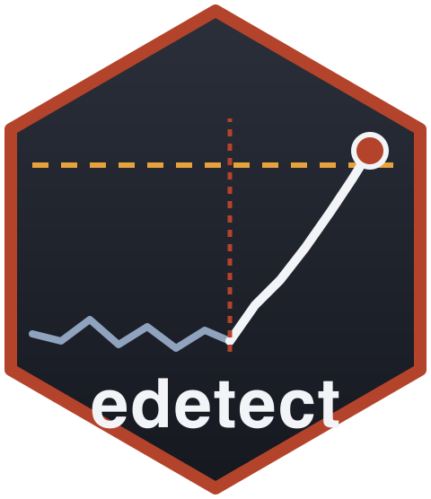

# edetect <a href="https://castlaboratory.github.io/edetect/"></a>

<!-- badges: start -->
[](https://github.com/castlaboratory/edetect/actions/workflows/R-CMD-check.yaml)
[](https://lifecycle.r-lib.org/articles/stages.html#experimental)
<!-- badges: end -->

**Anytime-valid control charts with e-detectors.**

`edetect` answers one question: *how do I monitor a process for a change and
raise an alarm with a guaranteed false-alarm rate, without assuming a
parametric model for the process before or after the change?* It implements
**e-detectors** (Shin, Ramdas & Rinaldo, 2024): nonparametric, anytime-valid
analogues of the CUSUM and Shiryaev–Roberts charts, built from e-values for
bounded, sub-Gaussian, Bernoulli or Poisson observations, with a guaranteed
**average run length** (ARL) to a false alarm under every distribution in the
declared pre-change class.

The package follows the Phase I / Phase II workflow of
[shewhartr](https://github.com/castlaboratory/shewhartr) and the result-contract
conventions of [seqbench](https://CRAN.R-project.org/package=seqbench): every
alarm (or its absence) comes with what was assumed, how the detector was built
and what was observed.

## Installation

```r
# install.packages("pak")
pak::pak("castlaboratory/edetect")
```

## Example

A bounded loss whose mean should stay at 0.5 rises after 60 observations.

```r
library(edetect)
set.seed(1)
x <- c(runif(60, 0.3, 0.7), runif(60, 0.5, 0.9))

chart <- edetect_x(x, bounds = c(0, 1), center = 0.5, arl = 370, direction = "up")
#> Warning: Alarm at t = 71; 49 later observations were not consumed.
edetect_alarm(chart)
#> # A tibble: 1 × 6
#>   alarm alarm_time evidence threshold change_estimate n_observed
#>   <lgl>      <int>    <dbl>     <dbl>           <int>      <int>
#> 1 TRUE          71     387.       370              58         71
autoplot(chart)
```

The same engine drives the attribute charts and a regression chart:

```r
edetect_p(defects, n = 100, center = 0.02, arl = 370)          # proportion nonconforming
edetect_c(counts, phase1 = counts_in_control, arl = 370)        # counts per unit
edetect_u(counts, n = exposure, center = 1.5, arl = 370)        # counts per unit exposure
edetect_regression(y ~ x, phase1 = d1, phase2 = d2, arl = 370)  # residuals of a Phase I model
```

Lower-level functions give full control: `edetect_design()` fixes the
pre-change class, the direction, the detector type (SR or CUSUM) and the mixture
of post-change shifts; `edetect_init()` and `edetect_update()` run it one
observation at a time; `edetect_report()`, `tidy()`, `glance()` and
`autoplot()` read the result; `edetect_arl()` simulates run lengths and
detection delays of a design.

## Guarantee

For a design with target `arl`, every pre-change distribution in the declared
class gives an expected time to a false alarm of at least `arl`. The classes are
*bounded* (known bounds, nothing else), *sub-Gaussian* (declared scale),
*Bernoulli* (p chart; any dependence within a subgroup) and *Poisson* (c and u
charts; no overdispersion). The price is detection delay, which the mixture of
shifts and `edetect_arl()` let you measure before monitoring.

## Related software

`edetect` is not a general change-point library. For classical charts
calibrated by simulation see [shewhartr](https://github.com/castlaboratory/shewhartr)
and [qcc](https://cran.r-project.org/package=qcc); for ARL computation of
CUSUM/EWMA charts see [spc](https://cran.r-project.org/package=spc); for
nonparametric sequential change-point models see
[cpm](https://cran.r-project.org/package=cpm). No package implementing
e-detectors was found on CRAN or PyPI (checked 2026-09-25 and 2026-10-10).

## References

Shin, J., Ramdas, A. and Rinaldo, A. (2024). E-detectors: a nonparametric
framework for sequential change detection. *The New England Journal of
Statistics in Data Science*, 2(2), 229–260.

## License

GPL (>= 3). © CAST Lab, Universidade Federal de Pernambuco.
