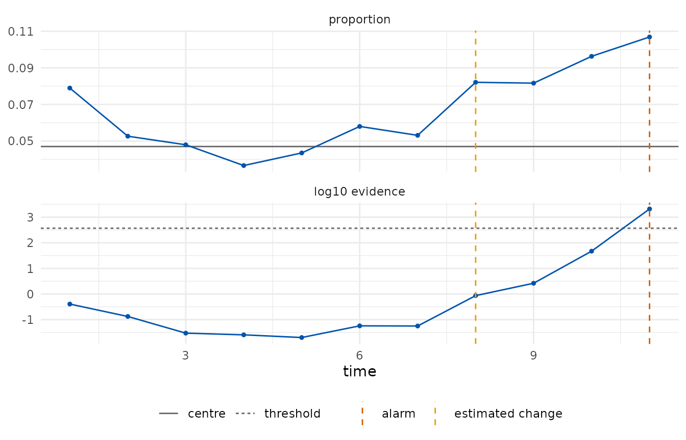
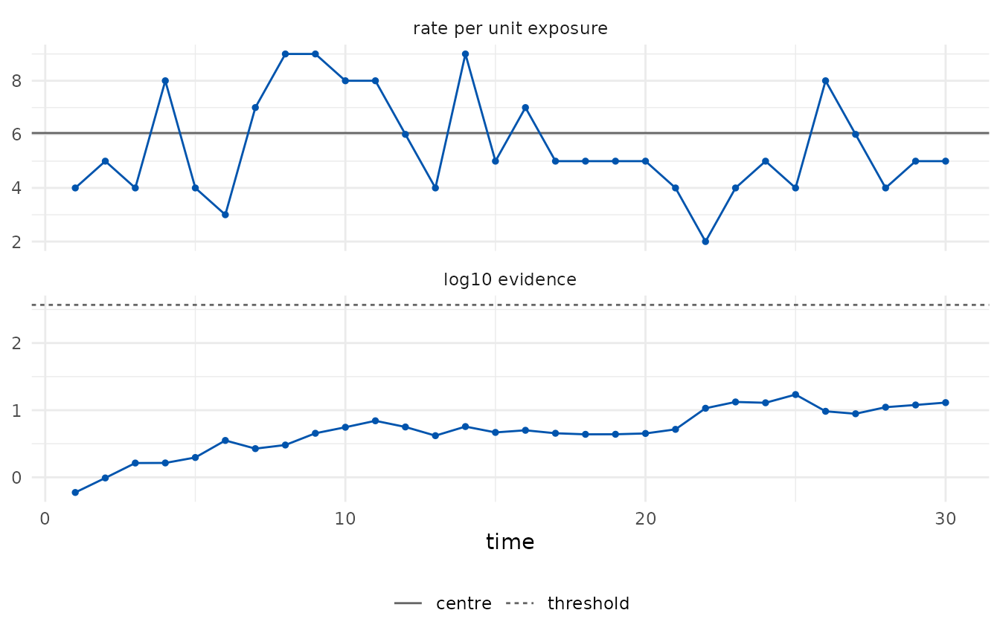
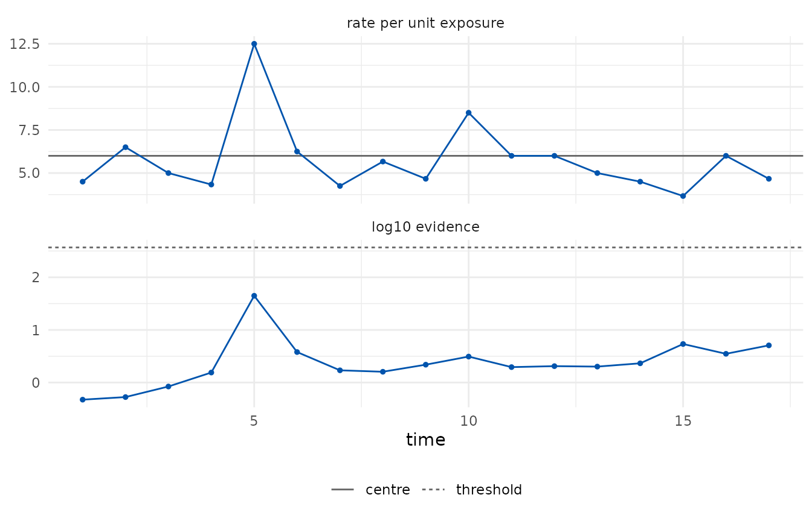

# Attribute charts: p, c and u

``` r

library(edetect)
```

Attribute charts monitor counts. The classical charts assume binomial or
Poisson counts and set three-sigma limits from a normal approximation.
The e-detector versions keep the counting model only as an upper bound
on the moment generating function, which is what the guarantee needs:

- the **p chart** assumes that each trial in a subgroup has a
  conditional success probability (given the earlier trials) at most, at
  least or equal to the centre; beyond that, dependence within a
  subgroup is allowed;
- the **c and u charts** assume that the counts are *sub-Poisson*: their
  moment generating function is at most that of a Poisson variable with
  the declared rate per unit exposure. Poisson and underdispersed counts
  qualify; overdispersed counts do not, and for those a bounded class
  with a declared maximum count is the honest choice.

## p chart: daily error rates of insurance claims

Each day a variable number of claims is processed and the claims with
errors are counted. The error rate is 5% for the first 22 days and 9%
from day 23. The first fifteen days serve as Phase I.

``` r

claims <- shewhartr::claims_p
head(claims, 3)
#> # A tibble: 3 × 3
#>     day     n defects
#>   <int> <int>   <int>
#> 1     1   134       7
#> 2     2   140       8
#> 3     3   129       6

p_chart <- edetect_p(x = claims$defects[16:30], n = claims$n[16:30],
                     phase1 = data.frame(x = claims$defects[1:15], n = claims$n[1:15]),
                     arl = 370, direction = "up")
#> Warning: Alarm at t = 11; 4 later observations were not consumed.
edetect_alarm(p_chart)
#> # A tibble: 1 × 6
#>   alarm alarm_time evidence threshold change_estimate n_observed
#>   <lgl>      <int>    <dbl>     <dbl>           <int>      <int>
#> 1 TRUE          11    2092.       370               8         11
autoplot(p_chart)
```



The alarm came at the eleventh Phase II day (day 26), three days after
the rate rose, and the change is estimated at the eighth Phase II day,
that is day 23. The Phase I estimate of the rate (0.047) is recorded as
an assumption of the chart.

``` r

edetect_report(p_chart)
#> 
#> ── e-detector report ───────────────────────────────────────────────────────────
#> Class "bernoulli", centre 0.04698 (phase1); direction "up"; type "sr"; target
#> ARL 370.
#> Observations: 11. Maximum evidence 2090 against a threshold of 370.
#> ✖ Alarm at t = 11 (evidence 2090); estimated change at t = 8.
#> 
#> ── Assumptions ──
#> 
#> • Pre-change trials have conditional success probability at most 0.04698; other
#> dependence within a subgroup is allowed.
#> • The centre was estimated from 15 Phase I observations and is treated as
#> known.
#> • Observations arrive in time order and none was dropped or imputed.
#> • Under these assumptions the expected time to a false alarm is at least 370,
#> and the probability of a false alarm by any time t is at most t/370.
#> edetect 0.1.0, R version 4.6.1 (2026-06-24)
```

## c chart: solder defects on circuit boards

Fifty boards are inspected and the defective solder joints on each are
counted; the process is stable with a mean of about 6. The first twenty
boards serve as Phase I. A stable process should produce no alarm, and
the evidence should stay far from the threshold.

``` r

defects <- shewhartr::pcb_solder$defects
c_chart <- edetect_c(defects[21:50], phase1 = defects[1:20], arl = 370, direction = "both")
edetect_alarm(c_chart)
#> # A tibble: 1 × 6
#>   alarm alarm_time evidence threshold change_estimate n_observed
#>   <lgl>      <int>    <dbl>     <dbl>           <int>      <int>
#> 1 FALSE         NA     13.0       370              17         30
max(tidy(c_chart)$evidence)
#> [1] 17.08296
autoplot(c_chart)
```



## u chart: defects per board in samples of unequal size

When boards are inspected in samples of two to four, the count per
sample is monitored per board inspected: the exposure `n` is the number
of boards. The rate per board is declared from the specification (6
defects per board).

``` r

set.seed(1)
sizes <- sample(2:4, 20, replace = TRUE)
sizes <- sizes[cumsum(sizes) <= 50]
sample_id <- rep(seq_along(sizes), sizes)
samples <- data.frame(n = sizes,
                      x = as.integer(tapply(defects[seq_along(sample_id)], sample_id, sum)))
head(samples, 4)
#>   n  x
#> 1 2  9
#> 2 4 26
#> 3 2 10
#> 4 3 13

u_chart <- edetect_u(samples$x, n = samples$n, center = 6, arl = 370, direction = "both")
edetect_alarm(u_chart)
#> # A tibble: 1 × 6
#>   alarm alarm_time evidence threshold change_estimate n_observed
#>   <lgl>      <int>    <dbl>     <dbl>           <int>      <int>
#> 1 FALSE         NA     5.08       370              13         17
autoplot(u_chart)
```



## What the alarm means, and what it does not

An alarm says that the evidence against the pre-change class reached the
target ARL. It does not say that the process changed: with a target ARL
of 370 a stable process produces, on average, one alarm every 370
observations or more. A missing alarm does not say that the process is
stable either; it says that the evidence has not accumulated yet, which
for small changes can take long.
[`edetect_arl()`](https://castlaboratory.github.io/edetect/reference/edetect_arl.md)
measures both sides for a design before monitoring (see the
[run-lengths](https://castlaboratory.github.io/edetect/articles/run-lengths.md)
vignette).
