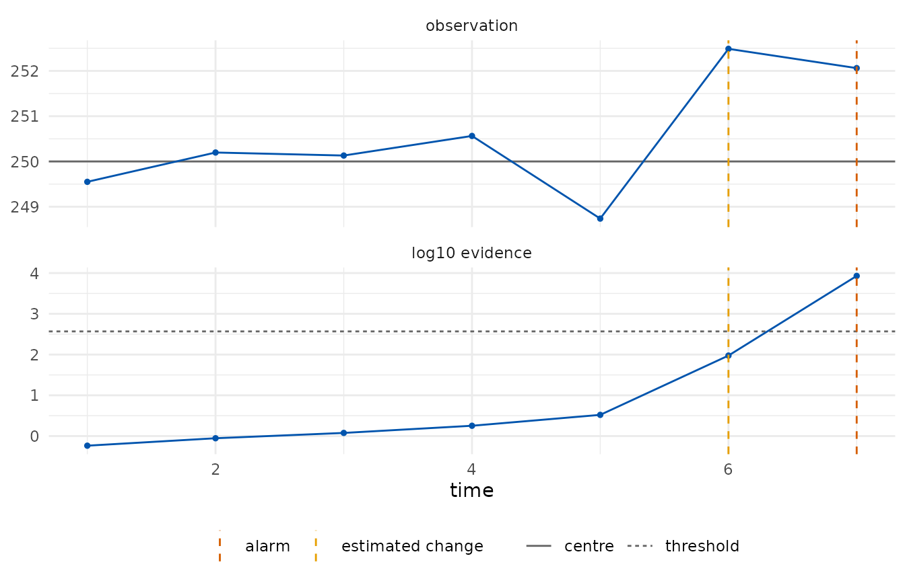
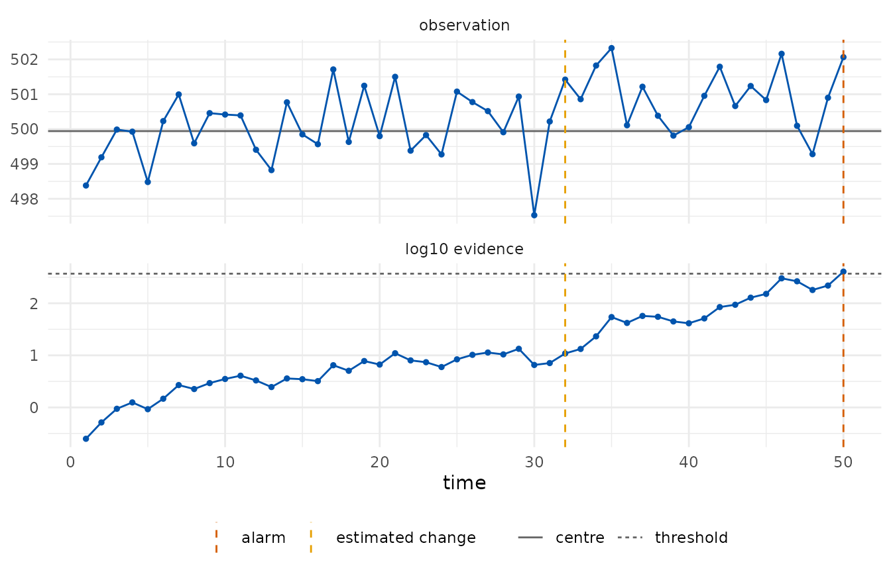

# Get started with edetect

``` r

library(edetect)
```

## What an e-detector is

A control chart watches a stream of observations and raises an alarm
when the process seems to have changed. The classical charts (Shewhart,
CUSUM, EWMA) are calibrated under a model for the in-control process,
usually Gaussian, and their false-alarm rate is only as good as that
model.

An **e-detector** (Shin, Ramdas and Rinaldo, 2024) replaces the model by
a *class*: everything the user is willing to assume about the process
before the change, for example “observations lie in \[495, 505\] and
their mean is 500”, or “observations have mean 250 and sub-Gaussian
tails with scale 0.67”. For every distribution in the class, the
expected time to a false alarm is at least the target **average run
length** (ARL). The detector accumulates *e-values*, bets against the
pre-change class, started at every time point; the Shiryaev–Roberts type
sums them, the CUSUM type keeps the largest, and the alarm is raised
when the accumulated evidence reaches the ARL.

The price of the guarantee is paid in detection delay: the detector
cannot know the size of the change, so it bets on a mixture of shifts.

The examples use the industrial datasets of the
[shewhartr](https://github.com/castlaboratory/shewhartr) package, so
that the two packages can be compared on the same data.

## A process with a declared centre and scale

Tablet weights are recorded in subgroups of five, with a target of 250
mg and a process standard deviation of 1.5 mg. A shift of 1.5 mg is
embedded from subgroup 18. We monitor the subgroup means, whose scale is
$`1.5/\sqrt{5}`$, with the first twelve subgroups serving as Phase I.

``` r

tablets <- aggregate(weight ~ subgroup, shewhartr::tablet_weight, mean)
head(tablets, 3)
#>   subgroup   weight
#> 1        1 250.6670
#> 2        2 250.0480
#> 3        3 250.2758

design <- edetect_design(arl = 370, class = "subgaussian", center = 250,
                         sigma = 1.5 / sqrt(5), direction = "both")
design
#> 
#> ── e-detector design ───────────────────────────────────────────────────────────
#> Pre-change class: "subgaussian"; centre 250 (declared)
#> Sub-Gaussian scale: 0.6708
#> Direction: "both"; type: "sr"; target ARL 370 (threshold 370 on the e-detector
#> scale)
#> Mixture over 12 shifts: 0.168, 0.335, 0.671, 1.01, 1.34, 2.01, -0.168, -0.335,
#> -0.671, -1.01, -1.34, -2.01
chart <- edetect_update(edetect_init(design), tablets$weight[13:25])
#> Warning: Alarm at t = 7; 6 later observations were not consumed.
chart
#> 
#> ── e-detector chart ────────────────────────────────────────────────────────────
#> "subgaussian" class, centre 250 (declared), direction "both", type "sr", target
#> ARL 370
#> ✖ Alarm at t = 7 (evidence 8510 >= 370); estimated change at t = 6.
```

The detector stopped at its seventh Phase II subgroup (subgroup 19) and
the observations after it were not consumed, which a warning reports.
Its estimate of the change point is the sixth Phase II subgroup, that is
subgroup 18, where the shift was embedded.

``` r

edetect_alarm(chart)
#> # A tibble: 1 × 6
#>   alarm alarm_time evidence threshold change_estimate n_observed
#>   <lgl>      <int>    <dbl>     <dbl>           <int>      <int>
#> 1 TRUE           7    8509.       370               6          7
autoplot(chart)
```



[`edetect_report()`](https://castlaboratory.github.io/edetect/reference/edetect_report.md)
lists what was assumed, how the detector was built and what happened;
[`tidy()`](https://generics.r-lib.org/reference/tidy.html) returns the
trajectory, one row per observation.

``` r

edetect_report(chart)
#> 
#> ── e-detector report ───────────────────────────────────────────────────────────
#> Class "subgaussian", centre 250 (declared); direction "both"; type "sr"; target
#> ARL 370.
#> Observations: 7. Maximum evidence 8510 against a threshold of 370.
#> ✖ Alarm at t = 7 (evidence 8510); estimated change at t = 6.
#> 
#> ── Assumptions ──
#> 
#> • Pre-change observations have mean equal to 250 and sub-Gaussian tails with
#> scale 0.6708.
#> • The centre was declared by the user.
#> • Observations arrive in time order and none was dropped or imputed.
#> • Under these assumptions the expected time to a false alarm is at least 370,
#> and the probability of a false alarm by any time t is at most t/370.
#> edetect 0.1.0, R version 4.6.1 (2026-06-24)
tidy(chart)
#> # A tibble: 7 × 9
#>       t     x     n log_evalue evidence evidence_cusum threshold change_estimate
#>   <int> <dbl> <dbl>      <dbl>    <dbl>          <dbl>     <dbl>           <int>
#> 1     1  250.     1     -0.543    0.581          0.581       370               1
#> 2     2  250.     1     -0.684    0.884          0.538       370               2
#> 3     3  250.     1     -0.702    1.19           0.503       370               2
#> 4     4  251.     1     -0.444    1.79           0.648       370               4
#> 5     5  249.     1      0.663    3.31           1.97        370               5
#> 6     6  252.     1      4.51    94.4           91.2         370               6
#> 7     7  252.     1      2.94  8509.          8453.          370               6
#> # ℹ 1 more variable: alarm <lgl>
```

## Phase I estimation and a slow drift

Fill volumes of a bottling line have a target of 500 ml. A linear drift
begins around observation 65. Here the centre and the scale are
estimated from the first fifty observations and recorded as an
assumption of the chart.

``` r

ml <- shewhartr::bottle_fill$ml
design <- edetect_design(arl = 370, class = "subgaussian", phase1 = ml[1:50],
                         direction = "up")
design
#> 
#> ── e-detector design ───────────────────────────────────────────────────────────
#> Pre-change class: "subgaussian"; centre 499.9 (phase1, n = 50)
#> Sub-Gaussian scale: 1.378
#> Direction: "up"; type: "sr"; target ARL 370 (threshold 370 on the e-detector
#> scale)
#> Mixture over 6 shifts: 0.344, 0.689, 1.38, 2.07, 2.76, 4.13
chart <- edetect_update(edetect_init(design), ml[51:100])
edetect_alarm(chart)
#> # A tibble: 1 × 6
#>   alarm alarm_time evidence threshold change_estimate n_observed
#>   <lgl>      <int>    <dbl>     <dbl>           <int>      <int>
#> 1 TRUE          50     405.       370              32         50
autoplot(chart)
```



A slow drift is a hard case for any detector: the mean moves by a
fraction of the scale per observation, so the evidence builds slowly.
The alarm came at the last observation and the change point is estimated
at observation 82, well after the drift began; a Phase I of fifty
observations also leaves the centre and the scale with sampling error,
which the report records.

The bounded class makes a weaker assumption: fill volumes are known to
lie in \[495, 505\] and nothing is assumed about their tails. The
betting e-values on that class are slower than the sub-Gaussian ones but
hold for any distribution on the interval.

``` r

design_b <- edetect_design(arl = 370, class = "bounded", bounds = c(495, 505),
                           phase1 = ml[1:50], direction = "up")
edetect_alarm(edetect_update(edetect_init(design_b), ml[51:100]))
#> # A tibble: 1 × 6
#>   alarm alarm_time evidence threshold change_estimate n_observed
#>   <lgl>      <int>    <dbl>     <dbl>           <int>      <int>
#> 1 FALSE         NA     291.       370               6         50
```

## Where to go next

- [Attribute
  charts](https://castlaboratory.github.io/edetect/articles/attribute-charts.md):
  p, c and u charts on counts.
- [Regression
  chart](https://castlaboratory.github.io/edetect/articles/regression-chart.md):
  monitoring residuals of a Phase I model when the process is not
  stationary.
- [Run lengths and
  delays](https://castlaboratory.github.io/edetect/articles/run-lengths.md):
  checking the guarantee and measuring the delay of a design before
  monitoring.

## References

Shin, J., Ramdas, A. and Rinaldo, A. (2024). E-detectors: a
nonparametric framework for sequential change detection. *The New
England Journal of Statistics in Data Science*, 2(2), 229–260.
