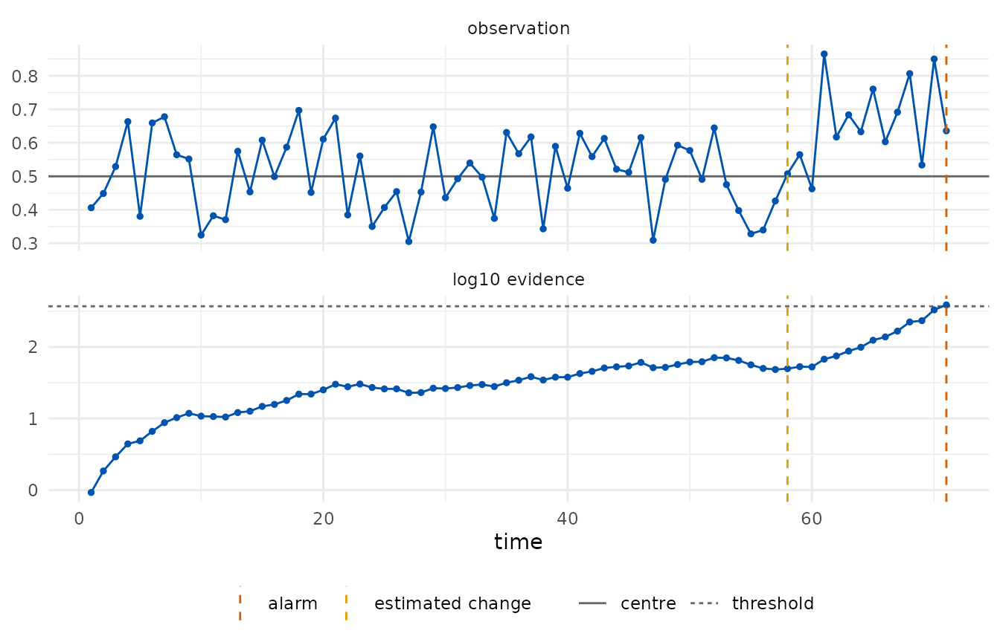
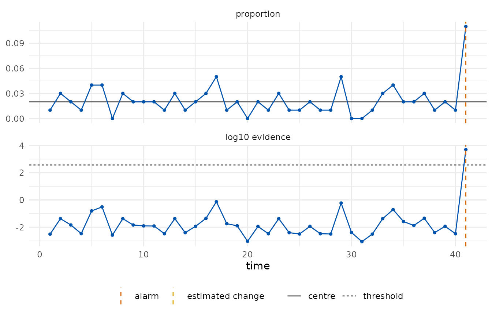

# Getting started with edetect

``` r

library(edetect)
```

## What an e-detector is

A control chart watches a stream of observations and raises an alarm
when the process seems to have changed. The classical charts (Shewhart,
CUSUM, EWMA) are calibrated under a model for the in-control process,
usually Gaussian, and their false-alarm rate is only as good as that
model.

An **e-detector** (Shin, Ramdas and Rinaldo, 2024) replaces the model by
a *class*: everything the user is willing to assume about the process
before the change, for example “observations lie in \[0, 1\] and their
mean is at most 0.5”. For every distribution in the class, the expected
time to a false alarm is at least the target **average run length**
(ARL). The detector accumulates *e-values*, bets against the pre-change
class, started at every time point; the Shiryaev–Roberts type sums them,
the CUSUM type keeps the largest, and the alarm is raised when the
accumulated evidence reaches the ARL.

The price of the guarantee is paid in detection delay: the detector
cannot know the size of the change, so it bets on a mixture of shifts.

## A bounded stream

A loss in \[0, 1\] whose mean should stay at 0.5. After 60 observations
the mean rises to 0.7.

``` r

set.seed(1)
x <- c(runif(60, 0.3, 0.7), runif(60, 0.5, 0.9))
chart <- edetect_x(x, bounds = c(0, 1), center = 0.5, arl = 370, direction = "up")
#> Warning: Alarm at t = 71; 49 later observations were not consumed.
chart
#> 
#> ── e-detector chart ────────────────────────────────────────────────────────────
#> "bounded" class, centre 0.5 (declared), direction "up", type "sr", target ARL
#> 370
#> ✖ Alarm at t = 71 (evidence 387 >= 370); estimated change at t = 58.
edetect_alarm(chart)
#> # A tibble: 1 × 6
#>   alarm alarm_time evidence threshold change_estimate n_observed
#>   <lgl>      <int>    <dbl>     <dbl>           <int>      <int>
#> 1 TRUE          71     387.       370              58         71
autoplot(chart)
```



The detector stopped at the alarm; the observations after it were not
consumed and a warning said so.
[`edetect_report()`](https://castlaboratory.github.io/edetect/reference/edetect_report.md)
lists what was assumed, how the detector was built and what happened,
and [`tidy()`](https://generics.r-lib.org/reference/tidy.html) returns
the trajectory.

``` r

edetect_report(chart)
#> 
#> ── e-detector report ───────────────────────────────────────────────────────────
#> Class "bounded", centre 0.5 (declared); direction "up"; type "sr"; target ARL
#> 370.
#> Observations: 71. Maximum evidence 387 against a threshold of 370.
#> ✖ Alarm at t = 71 (evidence 387); estimated change at t = 58.
#> 
#> ── Assumptions ──
#> 
#> • Pre-change observations lie in [0, 1] with mean at most 0.5 (nothing else
#> assumed).
#> • The centre was declared by the user.
#> • Observations arrive in time order and none was dropped or imputed.
#> edetect 0.0.0.9000, R version 4.6.1 (2026-06-24)
head(tidy(chart))
#> # A tibble: 6 × 9
#>       t     x     n log_evalue evidence evidence_cusum threshold change_estimate
#>   <int> <dbl> <dbl>      <dbl>    <dbl>          <dbl>     <dbl>           <int>
#> 1     1 0.406     1    -0.0780    0.925          0.925       370               1
#> 2     2 0.449     1    -0.0418    1.85           0.959       370               2
#> 3     3 0.529     1     0.0230    2.91           1.02        370               3
#> 4     4 0.663     1     0.123     4.42           1.16        370               3
#> 5     5 0.381     1    -0.100     4.88           1.04        370               3
#> 6     6 0.659     1     0.120     6.62           1.17        370               3
#> # ℹ 1 more variable: alarm <lgl>
```

## Phase I and Phase II

The centre is usually not known but estimated from in-control data.
Supplying `phase1` sets it and records the source as an assumption of
the chart.

``` r

design <- edetect_design(arl = 370, class = "bounded", bounds = c(0, 1),
                         phase1 = runif(100, 0.3, 0.7), direction = "both")
design
#> 
#> ── e-detector design ───────────────────────────────────────────────────────────
#> Pre-change class: "bounded"; centre 0.5095 (phase1, n = 100)
#> Bounds: [0, 1]; e-values: "betting"
#> Direction: "both"; type: "sr"; target ARL 370 (threshold 370 on the e-detector
#> scale)
#> Mixture over 14 shifts: 0.0245, 0.0491, 0.0981, 0.172, 0.245, 0.343, 0.441,
#> -0.0255, -0.0509, -0.102, -0.178, -0.255, -0.357, -0.459
```

## Attribute charts

A p chart monitors the proportion of nonconforming units in subgroups of
size `n`; a c chart counts nonconformities per unit; a u chart counts
them per unit of exposure. The pre-change class for p is “each trial has
success probability at most the centre” (dependence within a subgroup is
allowed); for c and u it is “counts are sub-Poisson with the declared
rate”, which excludes overdispersion.

``` r

set.seed(2)
defects <- c(rbinom(40, 100, 0.02), rbinom(30, 100, 0.06))
p_chart <- edetect_p(defects, n = 100, center = 0.02, arl = 370)
#> Warning: Alarm at t = 41; 29 later observations were not consumed.
edetect_alarm(p_chart)
#> # A tibble: 1 × 6
#>   alarm alarm_time evidence threshold change_estimate n_observed
#>   <lgl>      <int>    <dbl>     <dbl>           <int>      <int>
#> 1 TRUE          41    4980.       370              41         41
autoplot(p_chart)
```



With the daily COVID-19 deaths of Recife from the `shewhartr` package, a
c chart with the first four weeks as Phase I asks when the count left
its early level.

``` r

deaths <- shewhartr::cvd_recife$new_deaths
c_chart <- edetect_c(deaths[-(1:28)], phase1 = deaths[1:28], arl = 370, direction = "up")
#> Warning: Alarm at t = 2; 249 later observations were not consumed.
edetect_alarm(c_chart)
#> # A tibble: 1 × 6
#>   alarm alarm_time evidence threshold change_estimate n_observed
#>   <lgl>      <int>    <dbl>     <dbl>           <int>      <int>
#> 1 TRUE           2   29217.       370               1          2
```

## Regression chart

When the in-control level depends on covariates, a Phase I model is
fitted and the Phase II residuals are monitored as a sub-Gaussian stream
centred at zero with the residual scale of the fit.

``` r

set.seed(3)
d1 <- data.frame(load = 1:80); d1$time <- 10 + 0.4 * d1$load + rnorm(80, sd = 1)
d2 <- data.frame(load = 81:140); d2$time <- 10 + 0.4 * d2$load + rnorm(60, sd = 1) + c(rep(0, 30), rep(2.5, 30))
r_chart <- edetect_regression(time ~ load, phase1 = d1, phase2 = d2, arl = 370, direction = "up")
#> Warning: Alarm at t = 34; 26 later observations were not consumed.
edetect_alarm(r_chart)
#> # A tibble: 1 × 6
#>   alarm alarm_time evidence threshold change_estimate n_observed
#>   <lgl>      <int>    <dbl>     <dbl>           <int>      <int>
#> 1 TRUE          34  148698.       370              31         34
```

## Checking the guarantee and the delay

[`edetect_arl()`](https://castlaboratory.github.io/edetect/reference/edetect_arl.md)
simulates run lengths of a design: without a change it estimates the ARL
(which must be at least the target), with a change it estimates the
detection delay.

``` r

design <- edetect_design(arl = 100, class = "subgaussian", center = 0, sigma = 1, direction = "up")
set.seed(4)
edetect_arl(design, pre = function(n) rnorm(n), n_rep = 100, max_t = 3000)$summary
#> # A tibble: 1 × 6
#>   arl_estimate    se censored target_arl n_rep max_t
#>          <dbl> <dbl>    <dbl>      <dbl> <int> <int>
#> 1         168.  14.0        0        100   100  3000
edetect_arl(design, pre = function(n) rnorm(n), post = function(n) rnorm(n, 1),
            change_at = 50, n_rep = 100, max_t = 500)$summary
#> # A tibble: 1 × 7
#>   delay_mean    se false_alarm censored change_at n_rep max_t
#>        <dbl> <dbl>       <dbl>    <dbl>     <int> <int> <int>
#> 1       6.70 0.446        0.12        0        50   100   500
```

## References

Shin, J., Ramdas, A. and Rinaldo, A. (2024). E-detectors: a
nonparametric framework for sequential change detection. *The New
England Journal of Statistics in Data Science*, 2(2), 229–260.
