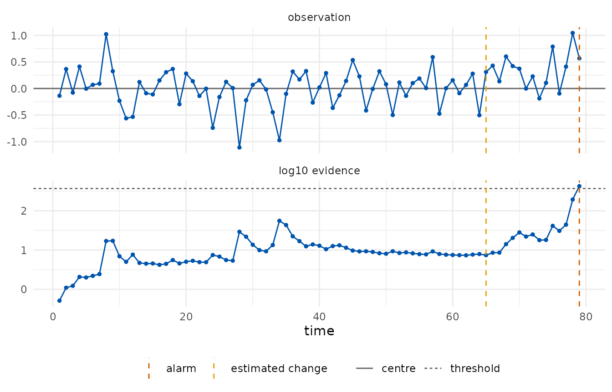

# Regression chart for non-stationary processes

``` r

library(edetect)
```

When the in-control level depends on covariates or on time, a chart on
the raw observations alarms for the wrong reason. The regression chart
fits a model on Phase I data and monitors the Phase II residuals,
`y - prediction`, as a sub-Gaussian stream centred at zero whose scale
is the residual standard deviation of the Phase I fit. The fit, the
scale and the Phase I size are recorded in the chart.

The model is part of the assumptions: a residual chart tests the model
as much as the process.

## A curing oven with drift and a periodic component

Two hundred readings of a curing oven show a slow linear drift with a
periodic component superimposed. The first hundred minutes are Phase I.

``` r

oven <- shewhartr::temperature_drift
head(oven, 3)
#> # A tibble: 3 × 2
#>   minute temp_c
#>    <int>  <dbl>
#> 1      1   180.
#> 2      2   180.
#> 3      3   180.
```

A linear model on time captures the drift but not the periodic
component, and the residuals of Phase II inherit it. The chart alarms
within a few minutes of Phase II, with an estimated change point at its
second minute: the alarm is against the model, not against the oven.

``` r

linear <- edetect_regression(temp_c ~ minute, phase1 = oven[1:100, ], phase2 = oven[101:200, ],
                             arl = 370, direction = "both")
#> Warning: Alarm at t = 8; 92 later observations were not consumed.
edetect_alarm(linear)
#> # A tibble: 1 × 6
#>   alarm alarm_time evidence threshold change_estimate n_observed
#>   <lgl>      <int>    <dbl>     <dbl>           <int>      <int>
#> 1 TRUE           8    2381.       370               2          8
```

A model with the periodic component (period 50 minutes, read off the
Phase I residuals) has a residual scale of 0.377 degrees and describes
Phase I well.

``` r

periodic <- edetect_regression(
  temp_c ~ minute + sin(2 * pi * minute / 50) + cos(2 * pi * minute / 50),
  phase1 = oven[1:100, ], phase2 = oven[101:200, ], arl = 370, direction = "both")
#> Warning: Alarm at t = 79; 21 later observations were not consumed.
edetect_alarm(periodic)
#> # A tibble: 1 × 6
#>   alarm alarm_time evidence threshold change_estimate n_observed
#>   <lgl>      <int>    <dbl>     <dbl>           <int>      <int>
#> 1 TRUE          79     425.       370              65         79
autoplot(periodic)
```



This chart alarms at minute 179 with the change estimated at minute 165.
The residuals of minutes 161 to 180 average about 0.25 degrees above the
model, two thirds of the residual scale, which is what the detector
reacted to. With a target ARL of 370 and a hundred Phase II
observations, a false alarm from a stable process has a probability of
roughly a quarter, so the data alone cannot tell a transient excursion
of the oven from a false alarm; what the guarantee promises is that such
alarms are rare in the long run.

``` r

edetect_report(periodic)
#> 
#> ── e-detector report ───────────────────────────────────────────────────────────
#> Class "subgaussian", centre 0 (phase1); direction "both"; type "sr"; target ARL
#> 370.
#> Observations: 79. Maximum evidence 425 against a threshold of 370.
#> ✖ Alarm at t = 79 (evidence 425); estimated change at t = 65.
#> 
#> ── Assumptions ──
#> 
#> • Pre-change observations have mean equal to 0 and sub-Gaussian tails with
#> scale 0.3771.
#> • The centre and the scale was estimated from 100 Phase I observations and is
#> treated as known.
#> • Observations arrive in time order and none was dropped or imputed.
#> • Under these assumptions the expected time to a false alarm is at least 370,
#> and the probability of a false alarm by any time t is at most t/370.
#> edetect 0.1.0, R version 4.6.1 (2026-06-24)
```

## Practical notes

- The residual scale is estimated from Phase I and treated as known. If
  Phase II residuals are more dispersed than Phase I, the sub-Gaussian
  assumption fails and alarms become more frequent than the guarantee
  says. A longer Phase I, or a declared `sigma` with a safety margin,
  protects against this.
- A sub-Gaussian class with a declared scale is a stronger assumption
  than a bounded class. When residuals have a known range,
  [`edetect_design()`](https://castlaboratory.github.io/edetect/reference/edetect_design.md)
  with `class = "bounded"` on the residuals gives a guarantee that does
  not depend on the tails.
- The change-point estimate is the start of the e-process that carries
  most of the evidence at the alarm; for a slow drift it points to where
  the drift became visible, not to where it began.
